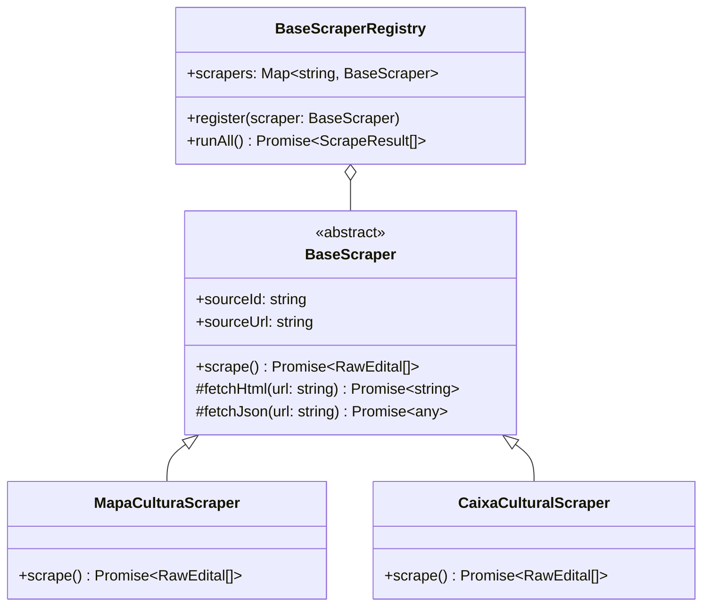

# Design Técnico: Motor Farejando (01-scraper-engine)

## 🏗️ Arquitetura do Componente (`#design-farejando`)

O motor de scraping é construído de maneira modular e extensível. Cada site monitorado possui seu próprio adaptador de scraping isolado, estendendo a classe abstrata `BaseScraper`.



---

## 📐 Interface de Dados (`RawEdital`)

```typescript
export interface RawEdital {
  sourceId: string;
  sourceUrl: string;
  externalId?: string;
  title: string;
  description?: string;
  rawPublishDate?: string;
  rawDeadlineDate?: string;
  rawBudget?: string;
  pdfLinks: string[];
  pageUrl: string;
  fetchedAt: Date;
}
```

---

## 🛠️ Bibliotecas e Ferramentas

- **Axios / Node-fetch**: Para portais com APIs REST ou páginas estáticas de HTML leve.
- **Cheerio**: Para parsing e extração via seletor CSS rápido.
- **Puppeteer**: Para sites dinâmicos (SPAs em React/Angular) que exigem execução de JavaScript no navegador.
