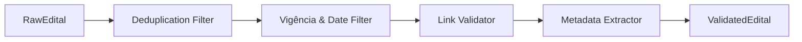

# Design Técnico: Motor Rabo Levantado (02-validation-engine)

## 🏗️ Arquitetura do Componente (`#design-rabo-levantado`)

O motor *Rabo Levantado* funciona como um pipeline de filtros encadeados:



---

## 📐 Estrutura de Dado Validado (`ValidatedEdital`)

```typescript
import { z } from 'zod';

export const EditalStatusEnum = z.enum(['NOVO', 'PRORROGADO', 'SEM_ALTERACAO', 'EXPIRADO']);

export const ValidatedEditalSchema = z.object({
  id: z.string().uuid(),
  contentHash: z.string(),
  sourceId: z.string(),
  title: z.string().min(3),
  description: z.string().optional(),
  organization: z.string(),
  pageUrl: z.string().url(),
  pdfLinks: z.array(z.string().url()),
  startDate: z.date().optional(),
  endDate: z.date(),
  totalBudget: z.number().optional(),
  maxBudgetPerProject: z.number().optional(),
  eligibleProfiles: z.array(z.enum(['PF', 'PJ', 'COLETIVO'])),
  geographicScope: z.enum(['JOAO_PESSOA', 'PARAIBA', 'NORDESTE', 'NACIONAL']),
  status: EditalStatusEnum,
  validatedAt: z.date(),
});

export type ValidatedEdital = z.infer<typeof ValidatedEditalSchema>;
```
