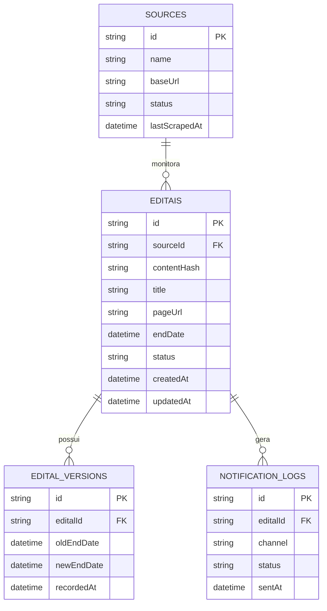

# Design Técnico: Motor Pote de Ração (03-storage)

## 🏗️ Modelo Entidade-Relacionamento (`#design-pote-de-racao`)



---

## 💻 Interface do Repositório (`EditalRepository`)

```typescript
export interface IEditalRepository {
  findByContentHash(hash: string): Promise<Edital | null>;
  findByPageUrl(url: string): Promise<Edital | null>;
  save(edital: ValidatedEdital): Promise<Edital>;
  markAsProrrogated(id: string, newEndDate: Date): Promise<void>;
  logNotification(editalId: string, channel: 'DISCORD' | 'WHATSAPP' | 'WEBSITE'): Promise<void>;
  wasNotified(editalId: string, channel: string): Promise<boolean>;
}
```
