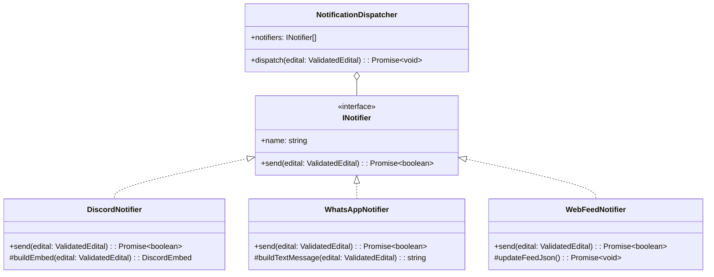

# Design Técnico: Motor Latidos (04-notifications)

## 🏗️ Arquitetura do Componente (`#design-latidos`)



---

## 🎨 Exemplo de Payload do Discord Embed

```json
{
  "embeds": [
    {
      "title": "🚨 NOVO EDITAL: Prêmio Funjope de Cultura Pop",
      "description": "Incentivo financeiro a projetos artísticos de João Pessoa.",
      "color": 5814783,
      "fields": [
        { "name": "🏛️ Órgão", "value": "Funjope - João Pessoa", "inline": true },
        { "name": "📅 Inscrições até", "value": "28/08/2026", "inline": true },
        { "name": "👤 Elegibilidade", "value": "Pessoa Física (PF) e Jurídica (PJ)", "inline": false }
      ],
      "url": "https://joaopessoa.pb.gov.br/secretarias/funjope/edital-1"
    }
  ]
}
```
