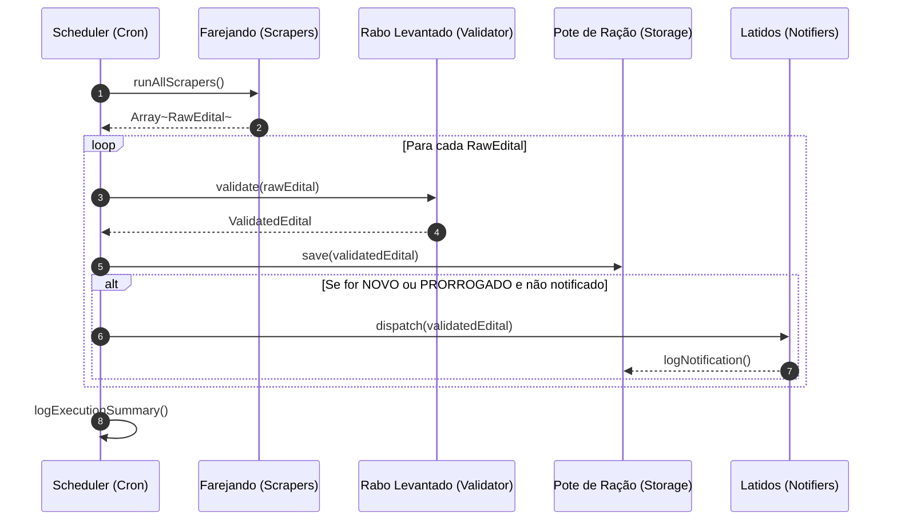

# Design Técnico: Motor de Orquestração (05-scheduler)

## 🏗️ Fluxo de Sequência da Orquestração (`#design-orquestracao`)



---

## 💻 Ponto de Entrada CLI (`src/index.ts`)

```typescript
import { Scheduler } from './scheduler/runner.js';

const scheduler = new Scheduler();

if (process.env.RUN_ONCE === 'true') {
  await scheduler.executeCycle();
} else {
  scheduler.startCronJob('0 * * * *'); // A cada hora
}
```
